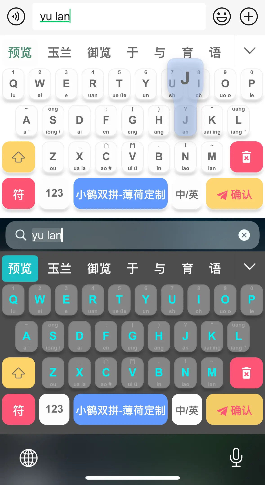
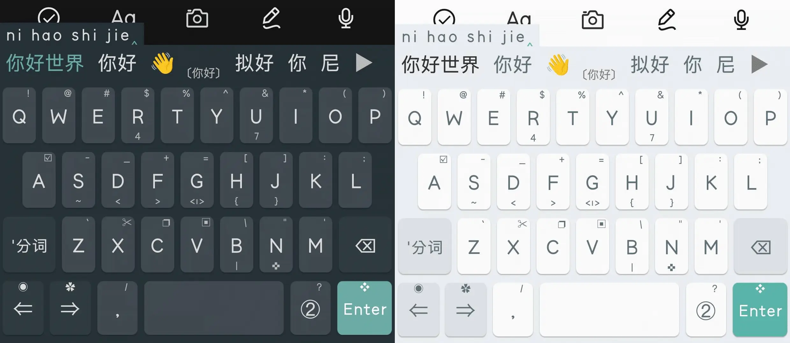

# Rime Theme

Rime Theme 是一个为 Rime 输入法引擎提供第三方主题的仓库，是 [oh-my-rime|薄荷输入法](https://github.com/ibupliz/oh-my-rime) 项目的补充。

oh-my-rime 自带了鼠须管和小狼毫的主题皮肤，但是Android的同文输入法和仓输入法比较特殊，所以另外建立此仓库。

## 主题预览

该仓库收录了的主题，尽可能匹配oh-my-rime内的黑水鸭和蓝水鸭样式：

安装教程: [仓输入法安装薄荷输入法主题和布局](ThemeForHamster/)

安装教程: [同文输入法安装薄荷输入法主题和布局](ThemeForTrime/)

> 其实，个人觉得，同文输入法安装主题和键盘样式的意义比较大…… 

## 贡献

我们欢迎为本仓库做出贡献!如果您创建了自定义 Rime 主题并希望与他人分享，请提交 Pull Request。请确保遵循现有的目录结构,并在 Pull Request 中对您的主题做出清晰的描述。

## 许可证

本仓库根据 [GPL-3.0 许可证](LICENSE) 授权。
