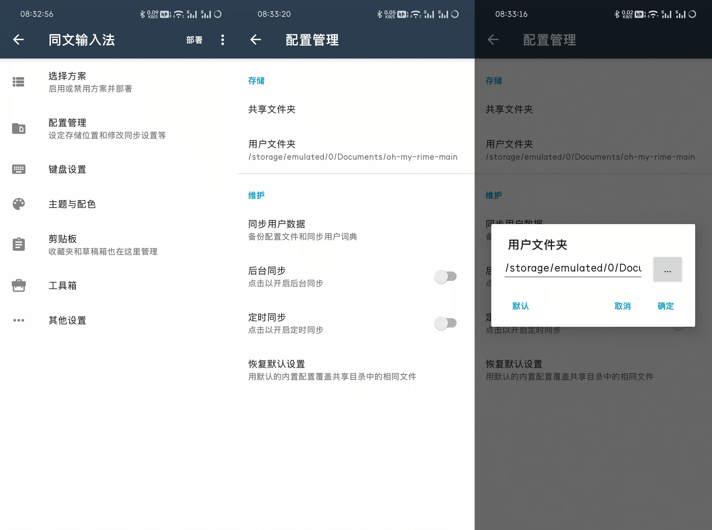
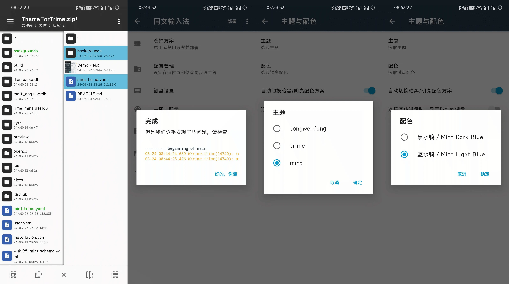

# 如何安装
安装很简单：
1.找到同文输入法配置目录，该目录为用户手动设置;
2.将静态资源文件夹`backgrounds`和主题文件`mint.trime.yaml`使用资源管理器移动到其中;
3.重新部署;
4.选择键盘布局以及键盘配色；

# 版本说明
本方案基于 单静 主题进行精简制作：
- [https://github.com/nopdan/danjing](https://github.com/nopdan/danjing)

# Demo
效果图如图：

